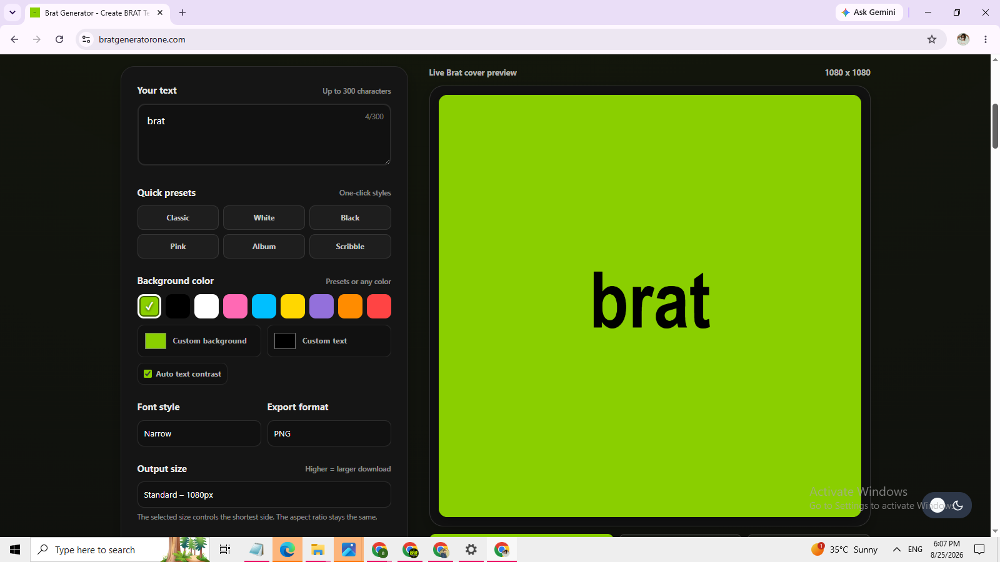

# Brat Generator One

Creating BRAT-inspired design tools for text graphics, memes, wallpapers, and creative visuals.

🌐 Website:
https://bratgeneratorone.com

## About

Brat Generator One is an online creative design platform inspired by the BRAT visual style.

The project helps creators make:

- BRAT-style text graphics
- aesthetic memes
- social media visuals
- wallpapers
- typography designs

## Tools

### Brat Generator Tools

A creative toolkit for generating BRAT-inspired typography graphics, memes, wallpapers, and social media visuals.

🔗 GitLab Repository:
https://gitlab.com/brat-generator-one-group/brat-generator-tools

### Brat Meme Generator

Create short meme-style visuals inspired by the BRAT aesthetic.

https://bratgeneratorone.com/brat-meme/

## Features

- Custom text creation
- Typography controls
- Color customization
- Blur and low-resolution effects
- Multiple canvas ratios
- Image export options
- Social media-ready designs

## Preview

  

## Resources

Learn more about the BRAT aesthetic:

https://bratgeneratorone.com/brat-aesthetic/

Explore more creative tools:

https://bratgeneratorone.com/

## Topics

BRAT aesthetic, graphic design, typography, meme generator, creative tools, design generator
